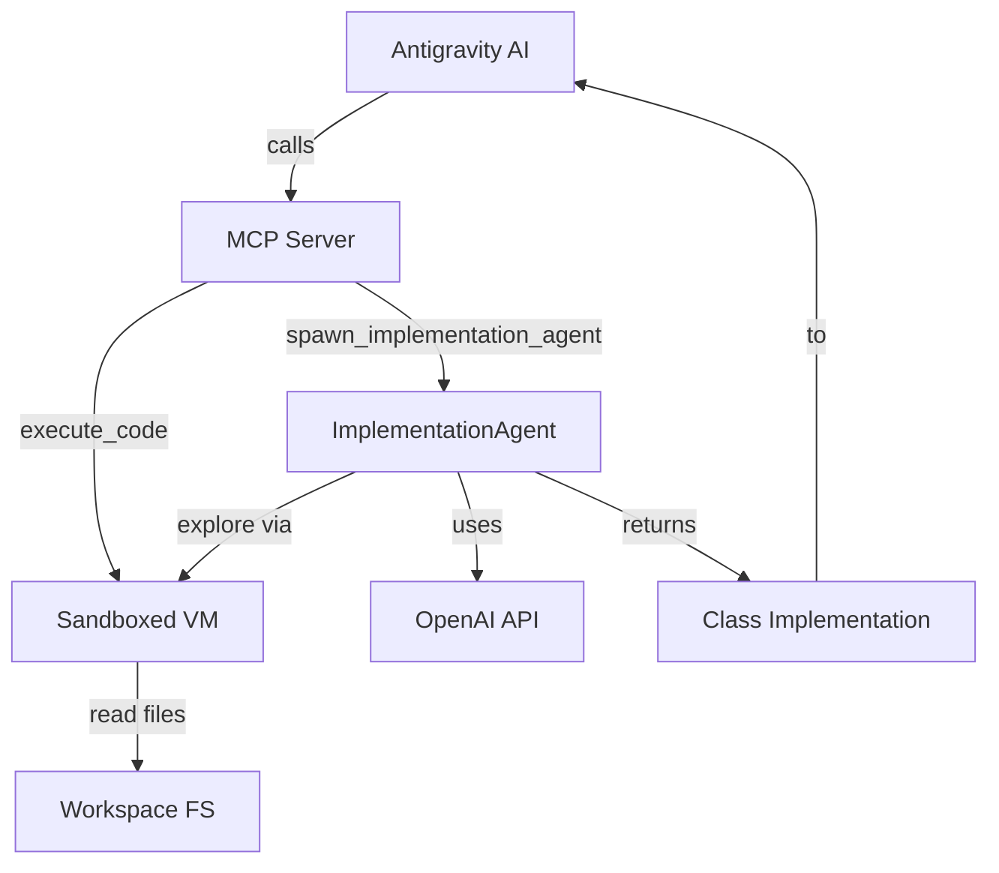

# MCP Tools for Antigravity Integration

Add custom MCP tools to the Intent Graph extension, exposing `execute_code` and `spawn_implementation_agent` to Antigravity's built-in AI.

## User Review Required

> [!IMPORTANT]
> MCP Server SDK dependency (`@modelcontextprotocol/sdk`) needs to be added. This is a new external dependency.

> [!NOTE]
> The `spawn_implementation_agent` returns code - it does NOT write files. Antigravity's AI is responsible for writing the returned code to the filesystem.

---

## Proposed Changes

### Dependencies

#### [MODIFY] [package.json](file:///c:/Users/mosze/IdeaProjects/semantic-graph-plugin/vscode-extension/package.json)
- Add `@modelcontextprotocol/sdk` dependency
- Add `zod` for tool parameter validation

---

### MCP Server Module

#### [NEW] [MCPServer.ts](file:///c:/Users/mosze/IdeaProjects/semantic-graph-plugin/vscode-extension/src/mcp/MCPServer.ts)
Create MCP server that exposes tools to Antigravity:

**Tools exposed:**
1. **`execute_code`** - Run JavaScript in sandboxed context with workspace access
   - Input: `{ code: string }`
   - Output: Result of code execution
   - Reuses sandboxed fs logic from `PlanningAgent.executeCode`

2. **`spawn_implementation_agent`** - Spawn focused implementation sub-agent
   - Input: `{ task: string, targetFile: string, className: string, context?: string }`
   - Output: `{ implementation: string, explanation: string }`
   - Uses OpenAI with specialized "single-class implementation" prompt
   - Sub-agent has access to `execute_code` for codebase exploration

---

### Implementation Agent

#### [NEW] [ImplementationAgent.ts](file:///c:/Users/mosze/IdeaProjects/semantic-graph-plugin/vscode-extension/src/agent/ImplementationAgent.ts)
New agent class focused on implementing a single class:

- Uses same OpenAI client configuration as `PlanningAgent`
- Has access to `execute_code` tool for exploring codebase
- Specialized prompt that constrains output to single class implementation
- Returns structured response: `{ implementation: string, explanation: string }`

---

### Prompt Template

#### [NEW] [implementation-agent.md](file:///c:/Users/mosze/IdeaProjects/semantic-graph-plugin/vscode-extension/prompts/implementation-agent.md)
System prompt for the implementation sub-agent:
- Focus on implementing exactly ONE class
- Can explore codebase via `execute_code`
- Must return complete, working implementation
- No side effects - only returns code

---

### Extension Integration

#### [MODIFY] [extension.ts](file:///c:/Users/mosze/IdeaProjects/semantic-graph-plugin/vscode-extension/src/extension.ts)
- Import and initialize `MCPServer`
- Start MCP server on extension activation
- Register MCP tools with VS Code/Antigravity

---

## Architecture Diagram

---

## Verification Plan

### Manual Testing

1. **Compile extension**: `npm run compile`
2. **Reload VS Code window** (Ctrl+Shift+P → "Developer: Reload Window")
3. **Check MCP server registration**:
   - Open Antigravity's MCP Store (via "..." dropdown)
   - Verify "Intent Graph" MCP server appears
4. **Test execute_code**:
   - In Antigravity chat, ask: "Use execute_code to list files in src folder"
   - Verify it returns file listing
5. **Test spawn_implementation_agent**:
   - Ask Antigravity: "Use spawn_implementation_agent to create a UserService class in src/services/UserService.ts"
   - Verify it returns class implementation code

> [!NOTE]
> Since this integrates with Antigravity's AI, manual testing is the primary verification method. No automated tests can be written for MCP tool registration.
